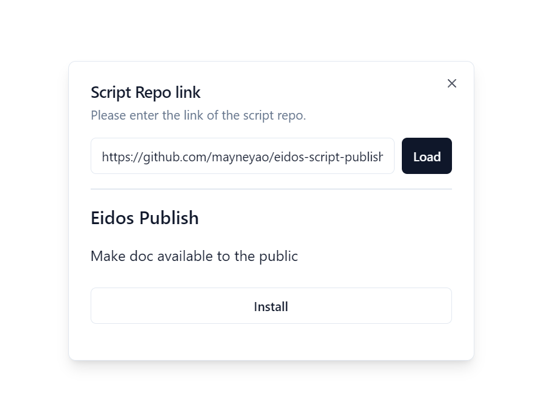
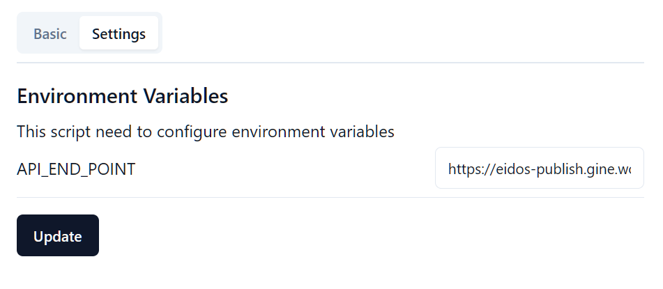
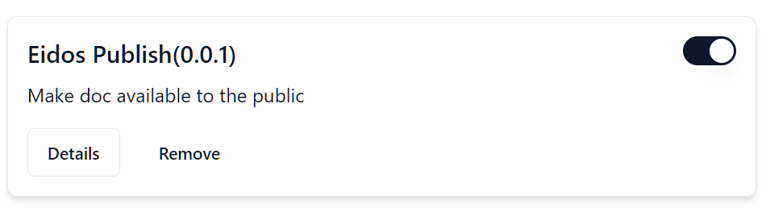
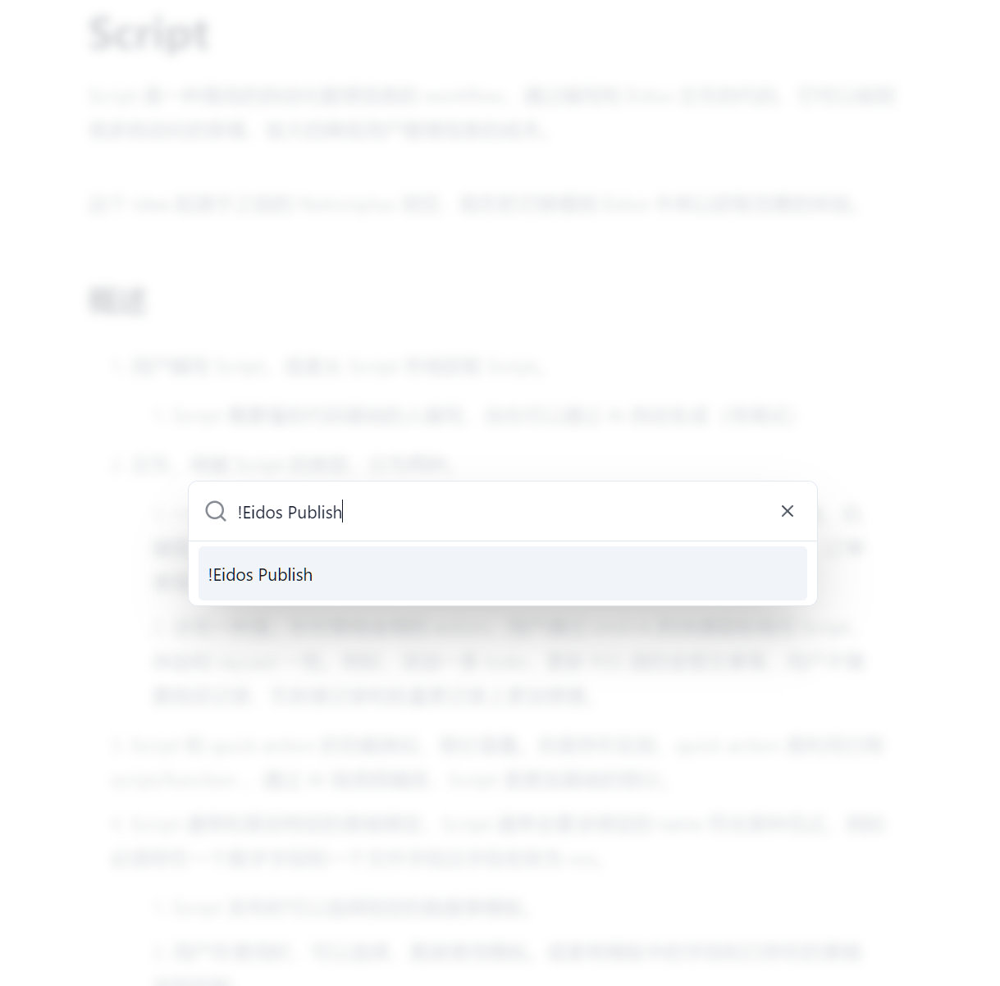

# Eidos Script Publish

Help Eidos users make their documents public.

## How to use

1. install this script

   1. Scripts - Install - From Github
   2. Paste `https://github.com/mayneyao/eidos-script-publish`
   3. Click `Load` then click `Install`
      

2. After installation, you need to configure the script

   1. Config `Settings - Environment - API_END_POINT`, click `Update`
      
      `https://eidos-publish.gine.workers.dev` is a free service provided by me, but just for test. You can also deploy your own service. see [eidos-publish](https://github.com/mayneyao/eidos-publish)
   2. Enable Script `Eidos Publish`
      

3. go to any document, `ctrl/cmd` + `k`, press `!` you will see all the script you can use, press `Enter` to publish current document
   

4. if you document id is `065410bdb05243659bbcdb3038b037f1`, you can visit `https://eidos-publish.gine.workers.dev/065410bdb05243659bbcdb3038b037f1` to see your document
